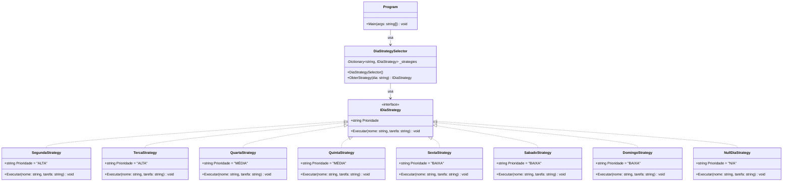

# Diagrama de Classes – Comportamento por Dia da Semana

```mermaid
classDiagram
    class IDiaStrategy {
        <<interface>>
        +string Prioridade
        +Executar(nome: string, tarefa: string) void
    }

    class SegundaStrategy {
        +string Prioridade = "ALTA"
        +Executar(nome: string, tarefa: string) void
    }

    class TercaStrategy {
        +string Prioridade = "ALTA"
        +Executar(nome: string, tarefa: string) void
    }

    class QuartaStrategy {
        +string Prioridade = "MÉDIA"
        +Executar(nome: string, tarefa: string) void
    }

    class QuintaStrategy {
        +string Prioridade = "MÉDIA"
        +Executar(nome: string, tarefa: string) void
    }

    class SextaStrategy {
        +string Prioridade = "BAIXA"
        +Executar(nome: string, tarefa: string) void
    }

    class SabadoStrategy {
        +string Prioridade = "BAIXA"
        +Executar(nome: string, tarefa: string) void
    }

    class DomingoStrategy {
        +string Prioridade = "BAIXA"
        +Executar(nome: string, tarefa: string) void
    }

    class NullDiaStrategy {
        +string Prioridade = "N/A"
        +Executar(nome: string, tarefa: string) void
    }

    class DiaStrategySelector {
        -Dictionary~string, IDiaStrategy~ _strategies
        +DiaStrategySelector()
        +ObterStrategy(dia: string) IDiaStrategy
    }

    class Program {
        +Main(args: string[]) void
    }

    IDiaStrategy <|.. SegundaStrategy
    IDiaStrategy <|.. TercaStrategy
    IDiaStrategy <|.. QuartaStrategy
    IDiaStrategy <|.. QuintaStrategy
    IDiaStrategy <|.. SextaStrategy
    IDiaStrategy <|.. SabadoStrategy
    IDiaStrategy <|.. DomingoStrategy
    IDiaStrategy <|.. NullDiaStrategy

    DiaStrategySelector --> IDiaStrategy : usa
    Program --> DiaStrategySelector : usa
```
